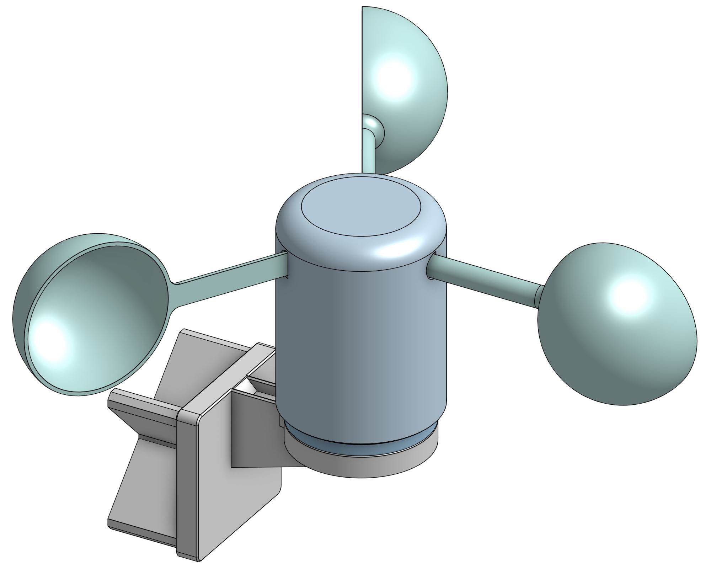
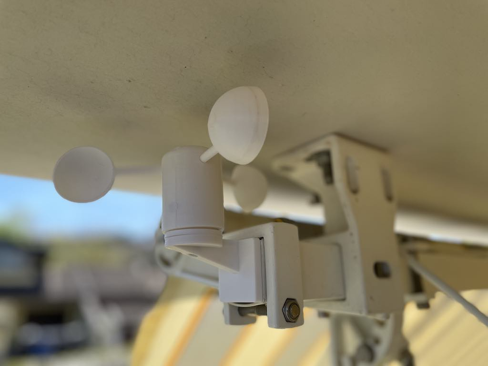

# 🌀 ESP32 ULP BLE Anemometer (BTHome V2)

A high-efficiency, battery-powered wind speed sensor (Anemometer) using the ESP32. This project leverages the **ULP (Ultra-Low Power) co-processor** to monitor wind pulses while the main CPU is in Deep Sleep, allowing for years of battery life.

## 🚀 Key Features

  * **Ultra-Low Power:** Can be as low as **\~15µA** in deep sleep on the ESP32 alone. Actual current depends on the board and any attached hardware. The main cores only wake up to calculate and transmit data.
  * **BTHome V2 Protocol:** Works natively with **Home Assistant** via Bluetooth—no custom integration or ESPHome YAML required. See [bthome.io](https://bthome.io).
  * **Intelligent Reporting:**
      * **Wind Detected:** Typically reports on the next 5-second wake cycle while wind is present.
      * **Change Detection:** Tries to report a speed change as soon as it is noticed on the next wake cycle.
      * **Heartbeat:** Sends a periodic "still alive" update, usually about every 60 seconds during calm periods.
  * **Hardware Debouncing:** ULP-based software sampling filters out mechanical reed switch "bounce."

-----

## 🛠 Hardware Requirements

1.  **ESP32 or ESP32-S3 Board**.
2.  **Anemometer** (3-cup type with a Reed Switch).
3.  **Battery:** Li-ion 18650 or LiPo.

### Bill of Materials

| Item | Quantity | Notes |
| :--- | :--- | :--- |
| ESP32 board | 1 | Use a board with an onboard battery sensor (divider) if possible |
| 3D-printed anemometer | 1 | Main wind-sensing body |
| 608 bearing 8x22x7 mm | 1 | Very common bearing for shaft support |
| M3 heat-set insert | 1 | For connecting the main body to the support |
| M3 hex socket cap screw M3x12 | 1 | Fastens the main body to the support |
| Reed switch | 1 | Wind pulse sensor |
| Magnet 6x3 mm | 2 | For triggering the reed switch |
| Battery | 1 | Li-ion 18650 or LiPo |

### Wiring

Connect the reed switch between SENSOR_GPIO pin and GND.

For battery monitoring, a board with an onboard battery divider is recommended.

-----

## 💻 Installation

### 1\. Libraries Required

Install the following libraries via the Arduino Library Manager:

  * [**NimBLE-Arduino**](https://github.com/h2zero/NimBLE-Arduino) (Lightweight Bluetooth LE)
  * [**BTHomeV2-Arduino**](https://github.com/deeja/BTHomeV2-Arduino) (BTHome data formatting)

### 2\. Configuration

Adjust the constants at the top of the sketch to match your hardware:

```cpp
const float RADIUS_METERS      = 0.071; // Center to cup middle
const float CALIBRATION_FACTOR = 2.5;   // Aerodynamic factor
const int   PULSES_PER_REV     = 2;     // Number of magnets in your sensor
```

**Tuning Guide:**

* **RADIUS_METERS**: Measure from the center of the shaft to the center of a cup.
* **PULSES_PER_REV**: Set this to the number of magnet passes per full revolution.
* **CALIBRATION_FACTOR**: Adjust this if you want accurate wind-speed measurements. Compare the reading against a known wind source or a reference sensor, then increase or decrease this factor until they match closely.

If you are only using the anemometer for threshold-based automation, such as closing an awning with a Shelly device, a precise calibration is usually not required. In that case, a stable and repeatable reading is enough to trigger the chosen wind-speed threshold.

### 3\. Flash

Upload the code to your ESP32. Open the Serial Monitor (115200 baud) to verify the "Fresh Boot" and "Deep Sleep" cycles.

-----

## 🏠 Home Assistant Integration

1.  Ensure the **Bluetooth** integration is active in Home Assistant.
2.  The sensor will be automatically discovered as a **BTHome** device named **"Wind Sensor"**.
3.  Add it to your dashboard. The wind speed will appear as a sensor entity in `m/s`.

-----

## 🔌 Shelly Integration

If you are using **Shelly** devices, the anemometer can also be configured as a **virtual component** in your Shelly setup. This does **not** require Home Assistant.

Depending on the Shelly virtual component setup, you may need the ESP32 BLE address.
To print it directly from the board, upload this small sketch and read the value from the Serial Monitor:

```cpp
#include <Arduino.h>
#include <NimBLEDevice.h>

void setup() {
  Serial.begin(115200);
  NimBLEDevice::init("ESP32");
}

void loop() {
  BLEAddress localAddress = NimBLEDevice::getAddress();
  Serial.println(localAddress.toString().c_str());
  delay(1000);
}
```

### Example Use Case

Use the anemometer to automatically close an awning with a **Shelly 2PM Gen3** when wind speed gets too high, without any extra wiring between the wind sensor and the Shelly device. The anemometer broadcasts wind data over BLE, and Shelly handles the automation logic on its side. In this setup, the ESP32 board and battery are hidden inside the square bar, which also supports the anemometer using an interlocking fit (no screw required).



-----

## 📉 Power Consumption Profile

  * **Deep Sleep (ULP Active):** \~15µA minimum, depending on the board and attached hardware
  * **BLE Transmission (1.5s):** \~100mA
  * **Total Battery Life:** \~1-2 years on a 2500mAh 18650 cell (depending on wind frequency).

-----

## 📜 License

This project is licensed under the MIT License - see the LICENSE file for details.

-----

## 🙌 Credits

  * **NimBLE-Arduino** by [h2zero](https://github.com/h2zero)
  * **BTHome V2** protocol by [bthome.io](https://bthome.io).
